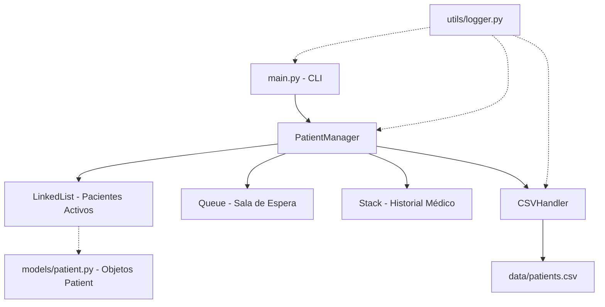

# Sistema de Gestión de Pacientes

Proyecto desarrollado en Python para administrar pacientes, citas médicas y procesos de triaje utilizando estructuras de datos personalizadas desde cero.

Este sistema está diseñado aplicando principios de Programación Orientada a Objetos (POO) y haciendo uso eficiente de las estructuras de datos clásicas para optimizar la gestión de turnos, el almacenamiento y la recuperación de información.

## Características Principales

*   **Gestión de Pacientes**: Registro, búsqueda y administración del historial de pacientes.
*   **Manejo de Citas Médicas**: Asignación y control de citas utilizando colas.
*   **Sistema de Triaje**: Asignación de prioridad a pacientes mediante Colas de Prioridad (Priority Queues), garantizando que las urgencias sean atendidas primero.
*   **Gestión de Especialidades**: Manejo de las diferentes ramas médicas del centro.
*   **Persistencia de Datos**: Almacenamiento seguro mediante archivos CSV (`manejador_csv.py`), permitiendo que la información perdure entre diferentes ejecuciones.
*   **Registro de Actividades (Logs)**: Trazabilidad del sistema con el uso de un módulo logger personalizado.

## Estructuras de Datos Implementadas

El sistema implementa sus propias estructuras de datos (sin depender de colecciones avanzadas por defecto) para un mayor control y entendimiento de las estructuras subyacentes:

- **Listas Enlazadas (`lista_enlazada.py`)**: Para el manejo dinámico de colecciones de datos.
- **Pilas (`pila.py`)**: Útiles para historiales o deshacer/rehacer acciones.
- **Colas (`cola.py`)**: Para el manejo de pacientes en orden de llegada.
- **Colas de Prioridad (`cola_prioridad.py`)**: Esencial para el sistema de triaje donde la urgencia dicta el orden de atención.

## Tecnologías y Requisitos

- Python 3.12+
- Módulos estándar de Python (`csv`, `logging`, `datetime`, etc.)

## Instalación y Ejecución

1. Clonar el repositorio:
   ```bash
   git clone https://github.com/TheBloodyCode/Sistema-Gestion-Pacientes.git
   cd Sistema-Gestion-Pacientes
   ```

2. Ejecutar la aplicación principal:
   ```bash
   python main.py
   ```

3. O ejecutar las pruebas unitarias:
   ```bash
   python test_patient_management.py
   ```

## Estructura del Proyecto

```
SISTEMA DE GESTIÓN DE PACIENTES/
├── data/                  # Archivos CSV para persistencia (citas.csv, patients.csv)
├── data_structures/       # Implementación de las ED (Colas, Pilas, Listas enlazadas)
├── models/                # Modelos de datos (Cita Médica, Especialidad, Paciente)
├── services/              # Lógica de negocio (Gestor de Pacientes, Triaje, Especialidades)
├── utils/                 # Utilidades (Logger, Manejador de CSV)
├── main.py                # Punto de entrada de la aplicación
├── requirements.txt       # Dependencias
└── test_patient_management.py # Pruebas del sistema
```

### Gestión de Pacientes
-  **Registro de Pacientes**: Añade, busca y elimina pacientes con información completa
-  **Múltiples Opciones de Registro**: Registro general, por especialidad, o como emergencia
-  **Historial Médico**: Registra y consulta el historial médico de cada paciente
-  **Ordenamiento**: Ordena pacientes por edad o nombre alfabéticamente

###  Sistema de Triaje de Emergencias
- **Evaluación Automática de Urgencia**: Algoritmo inteligente con 5 niveles de prioridad (1-5)
- **Detección de Síntomas Críticos**: 15+ palabras clave de emergencia
- **Evaluación de Signos Vitales**: Presión arterial, frecuencia cardíaca, temperatura
- **Factores de Edad**: Consideraciones especiales para pacientes >65 años o <2 años
- **Cola de Prioridades**: Gestión de emergencias con atención prioritaria

###  Gestión de Especialidades Médicas
- **10 Especialidades Disponibles**: 
  - Medicina General
  - Dermatología, Urología, Cardiología, Pediatría
  - Ginecología, Traumatología, Oftalmología
  - Otorrinolaringología (ORL), Neurología
- **Programación de Citas**: Agendar citas por especialidad con fechas y horas
- **Verificación de Disponibilidad**: Sistema inteligente de conflictos de horarios
- **8 Tipos de Cita**: Emergencia, Consulta General, Seguimiento, Cirugía Programada, etc.

###  Gestión de Salas de Espera
- **11 Salas de Espera**: 1 para emergencias + 10 para especialidades
- **Estado en Tiempo Real**: Ver cantidad de pacientes por sala
- **Priorización Inteligente**: Emergencias > Especialidades > General

###  Persistencia de Datos
- **Guardado en CSV**: Datos persistentes en `data/patients.csv` y `data/citas.csv`
- **Carga Automática**: Restaura datos al iniciar la aplicación
- **Transacciones Seguras**: Manejo seguro de lectura/escritura

###  Logging y Auditoría
- **Logs Detallados**: Archivo `logs/app_YYYYMMDD.log` con todas las operaciones
- **Información Crítica Registrada**: Triaje, registros, atenciones, errores
- **Trazabilidad Completa**: Auditoría de todas las acciones

###  Interfaz de Usuario
- **Menú Interactivo Completo**: 18 opciones ordenadas por categorías
- **Emojis Descriptivos**: Interfaz visual y amigable
- **Validación de Entrada**: Protección contra errores de usuario
- **Mensajes Claros**: Feedback inmediato en cada operación

###  Documentación Completa
- **100% Comentado en Español**: Cada línea del código incluye explicaciones detalladas
- **Docstrings Extensos**: Descripción de cada función y método
- **Interfaz en Español**: Menús, mensajes y errores completamente en español

##  Estructura del Proyecto

```
SISTEMA DE GESTIÓN DE PACIENTES/
├── data_structures/              # Estructuras de datos personalizadas
│   ├── __init__.py
│   ├── nodo.py                   # Clase Nodo base
│   ├── lista_enlazada.py         # Lista enlazada para pacientes
│   ├── cola.py                   # Cola FIFO para salas de espera general
│   ├── pila.py                   # Pila LIFO para historial
│   └── cola_prioridad.py         #  NUEVO: Cola de prioridades para emergencias
│
├── models/                        # Modelos de datos
│   ├── __init__.py
│   ├── paciente.py               # Clase Paciente
│   └── especialidad.py           #  NUEVO: Enums de especialidades y tipos de cita
│
├── models/ (continuación)
│   ├── cita_medica.py            #  NUEVO: Modelo de citas médicas
│
├── services/                      # Lógica de negocio
│   ├── __init__.py
│   ├── gestor_pacientes.py       #  ACTUALIZADO: Gestor principal coordinador
│   ├── gestor_triaje.py          #  NUEVO: Sistema de triaje de emergencias
│   └── gestor_especialidades.py  #  NUEVO: Gestión de citas y especialidades
│
├── utils/                         # Utilidades auxiliares
│   ├── __init__.py
│   ├── logger.py                 # Sistema de logging
│   └── manejador_csv.py          # Manejo de CSV
│
├── logs/                          #  Directorio de logs (generado automáticamente)
│   └── app_YYYYMMDD.log
│
├── data/                          #  Directorio de datos (generado automáticamente)
│   ├── patients.csv
│   └── citas.csv                 #  NUEVO
│
├── main.py                        #  ACTUALIZADO: Interfaz CLI con 18 opciones
├── test_patient_management.py    # Tests unitarios
├── __init__.py
└── README.md                      # Este archivo
```

##  Requerimientos

*   **Python 3.7 o superior**
*   No se requieren bibliotecas externas adicionales (usa solo módulos estándar de Python).

##  Instalación y Ejecución

Sigue estos pasos para configurar y ejecutar el proyecto:

1.  **Clonar el repositorio (o descargar los archivos):**

    Si estás usando Git, puedes clonar el repositorio:
    ```bash
    git clone <URL_DEL_REPOSITORIO>
    cd patient_management_system
    ```
    Si descargaste los archivos directamente, navega hasta el directorio `patient_management_system`.

2.  **Ejecutar la aplicación:**

    Desde el directorio raíz del proyecto (`patient_management_system`), ejecuta el archivo `main.py`:
    ```bash
    python main.py
    ```
    *(Nota: Usa `python3` en sistemas Linux/macOS si `python` no funciona)*

    Esto iniciará la interfaz de línea de comandos (CLI) del sistema de gestión de pacientes.

3.  **Ejecutar los tests unitarios (opcional):**

    Para verificar que todo funciona correctamente:
    ```bash
    python test_patient_management.py -v
    ```

##  Funcionalidades del Menú Principal (18 Opciones)

###  REGISTRO DE PACIENTES (Opciones 1-3)
1. ** Registrar nuevo paciente (consulta general)**
   - Crea un paciente con datos básicos (cédula, nombre, edad, género)
   - Se añade automáticamente a la lista de pacientes
   - Genera ID único en el sistema

2. ** Registrar paciente por especialidad**
   - Registra un paciente indicando la especialidad que requiere
   - Selecciona entre 10 especialidades médicas disponibles
   - Permite ingresar síntomas iniciales
   - Se añade a la sala de espera de esa especialidad

3. ** REGISTRAR EMERGENCIA (triaje urgente)**
   - Registra un paciente en estado de emergencia
   - Sistema de triaje automático evalúa urgencia
   - Detección de síntomas críticos (15+ palabras clave)
   - Evaluación de signos vitales (presión, FC, temperatura)
   - Asigna prioridad 1-5 automáticamente
   - Se añade a cola de emergencias

###  ATENCIÓN DE PACIENTES (Opciones 4-5)
4. ** Atender siguiente paciente**
   - Selecciona el siguiente paciente a atender
   - Priorización: Emergencias > Especialidades > General
   - Muestra información completa del paciente
   - Historial médico disponible
   - Registra el evento en los logs

5. ** Ver estado de TODAS las salas de espera**
   - Muestra cantidad de pacientes en cada sala
   - 11 salas totales: 1 emergencias + 10 especialidades
   - Lista detallada de pacientes en emergencias por prioridad
   - Actualizadas en tiempo real

###  CITAS CON ESPECIALISTAS (Opciones 6-9)
6. ** Agendar cita con especialista**
   - Crea una cita programada para un paciente existente
   - Selecciona especialidad (10 opciones)
   - Elige tipo de cita (8 tipos disponibles)
   - Especifica fecha y hora
   - Sistema verifica disponibilidad automáticamente
   - Guarda en persistencia (CSV)

7. ** Ver horarios disponibles de especialidad**
   - Consulta horarios libres por especialidad
   - Especifica la fecha deseada
   - Muestra franjas horarias disponibles
   - Información útil antes de agendar

8. ** Ver citas programadas de un paciente**
   - Muestra todas las citas de un paciente
   - Estado de cada cita (Programada, En Progreso, Completada, Cancelada)
   - Detalles: especialidad, fecha, hora, tipo
   - Notas adicionales si existen

9. ** Cancelar una cita médica**
   - Permite cancelar una cita existente
   - Actualiza el estado a "Cancelada"
   - Registra la cancelación en logs

###  CONSULTAS Y BÚSQUEDA (Opciones 10-12)
10. ** Ver todos los pacientes**
    - Lista completa de pacientes registrados
    - Información: nombre, cédula, edad, género
    - Cantidad de registros médicos por paciente
    - Formato tabla clara y legible

11. ** Buscar paciente por ID o nombre**
    - Búsqueda flexible por cédula o nombre completo
    - Muestra información detallada del paciente encontrado
    - Historial médico completo
    - Información de emergencias si aplica

12. ** Ver lista de pacientes en emergencias**
    - Lista de todos los pacientes en estado de emergencia
    - Ordenados por prioridad (5 = máxima)
    - Prioridad asignada y descripción
    - Síntomas y razón de la emergencia

###  HISTORIAL MÉDICO (Opciones 13-14)
13. ** Añadir registro médico a paciente**
    - Agrega una anotación al historial médico
    - Asocia el registro con la fecha y hora actual
    - Persiste en base de datos
    - Auditable en logs

14. ** Ver historial médico de un paciente**
    - Consulta todos los registros médicos
    - Muestra cronológicamente
    - Información completa de cada anotación

###  GESTIÓN DEL SISTEMA (Opciones 15-17)
15. ** Ordenar pacientes por edad**
    - Lista de pacientes ordenada de menor a mayor edad
    - Útil para análisis demográfico
    - Visualización clara por número

16. ** Ordenar pacientes por nombre**
    - Lista de pacientes en orden alfabético
    - Facilita búsqueda manual
    - Información de edad incluida

17. ** Eliminar paciente del sistema**
    - Elimina permanentemente un paciente
    - Requiere confirmación (protección contra errores)
    - Se elimina de todas las listas (general, emergencias, citas)
    - Registra eliminación en logs

**0.  Salir del sistema**
   - Cierra la aplicación de forma segura
   - Guarda todos los datos pendientes
   - Registra cierre en logs

##  Documentación del Código

Cada archivo y clase en el proyecto está **totalmente comentado en español** con docstrings y explicaciones paso a paso.

###  Sistema de Triaje de Emergencias

#### `services/gestor_triaje.py`
Implementa el algoritmo de evaluación de urgencia para pacientes en emergencia:

**Niveles de Prioridad:**
- **Prioridad 5**: Emergencia Vital (riesgo inmediato de muerte)
- **Prioridad 4**: Urgencia Mayor (riesgo de deterioro rápido)
- **Prioridad 3**: Urgencia Menor (requiere atención en horas)
- **Prioridad 2**: Consulta Prioritaria (problemas significativos)
- **Prioridad 1**: Consulta Normal (problemas leves)

**Criterios de Evaluación:**
1. **Síntomas Críticos** (15+ palabras clave):
   - Dolor torácico, hemorragia, dificultad respiratoria
   - Pérdida de conciencia, trauma, quemadura
   - Convulsión, alergia severa, intoxicación, etc.

2. **Signos Vitales:**
   - Presión sistólica > 180 mmHg → Prioridad 4
   - Frecuencia cardíaca > 140 lpm → Prioridad 4
   - Temperatura > 39.5°C → Prioridad 3
   - Presión sistólica < 90 mmHg → Prioridad 5

3. **Factores de Edad:**
   - Edad > 65 años → Prioridad 2
   - Edad < 2 años → Prioridad 3

**Métodos Principales:**
- `evaluar_urgencia(paciente, sintomas, signos_vitales)`: Calcula la prioridad
- `añadir_emergencia(paciente, prioridad, razon)`: Añade a cola de emergencias
- `obtener_siguiente_emergencia()`: Obtiene paciente más urgente
- `obtener_lista_emergencias()`: Lista ordenada por prioridad

#### `data_structures/cola_prioridad.py`
Implementa una cola con gestión de prioridades para emergencias:
- Estructura: Tuplas (prioridad, contador, paciente)
- Ordenamiento: Por prioridad descendente, FIFO para empates
- Métodos: `encolar()`, `desencolar()`, `ver_primero()`, `obtener_todos()`

###  Sistema de Citas Médicas

#### `models/cita_medica.py`
Define el modelo de citas médicas:
- **ID único**: Generado automáticamente
- **Estados**: Programada, En Progreso, Completada, Cancelada
- **Duración estimada**: Varía por especialidad (30-50 minutos)
- **Persistencia**: Serializable a CSV

#### `services/gestor_especialidades.py`
Gestiona la programación de citas y disponibilidad:
- **10 Especialidades**: Cada una con horario único
- **Duración de citas**: 30-50 minutos según especialidad
- **Verificación de conflictos**: Evita solapamientos
- **Disponibilidad**: Calcula franjas libres automáticamente
- **Persistencia**: Guarda/carga citas en `data/citas.csv`

**Horarios por Especialidad:**
- Medicina General: 30 min/cita, 8:00-17:00
- Dermatología: 45 min/cita, 9:00-18:00
- Cardiología: 50 min/cita, 8:00-16:00
- (Y 7 especialidades más)

###  Gestión Central

#### `services/gestor_pacientes.py`
Coordinador principal que integra todas las funcionalidades:
- **Registro**: General, especialidad, emergencia
- **Atención**: Prioriza emergencias > especialidades > general
- **Citas**: Delegación a `GestorEspecialidades`
- **Triaje**: Delegación a `GestorTriaje`
- **Salas de espera**: 11 colas independientes

**Métodos Principales:**
- `add_patient()`: Registra paciente general
- `registrar_paciente_especialidad()`: Registra con especialidad
- `registrar_paciente_con_emergencia()`: Registra con triaje
- `atender_siguiente_paciente()`: Obtiene siguiente paciente
- `obtener_estado_salas_espera()`: Estado de todas las salas
- `programar_cita_especialista()`: Agenda cita
- `obtener_horarios_disponibles()`: Consulta disponibilidad

#### `models/especialidad.py`
Define enumeraciones de especialidades y tipos de cita:

**EspecialidadMedica (10 opciones):**
- MEDICINA_GENERAL, DERMATOLOGIA, UROLOGIA, CARDIOLOGIA
- PEDIATRIA, GINECOLOGIA, TRAUMATOLOGIA, OFTALMOLOGIA
- OTORRINOLARINGOLOGIA, NEUROLOGIA

**TipoCita (8 opciones):**
- EMERGENCIA, CONSULTA_GENERAL, SEGUIMIENTO
- CIRUGIA_PROGRAMADA, CHEQUEO_PREVENTIVO
- CONSULTA_ESPECIALIZADA, DIAGNOSTICO, LABORATORIO

###  Persistencia de Datos

#### `utils/manejador_csv.py`
Manejo seguro de lectura/escritura en CSV:
- Crea directorio `data/` automáticamente
- Métodos: `read_data()`, `write_data()`
- Transacciones seguras

#### `utils/logger.py`
Sistema de logging con auditoría:
- Archivos en `logs/app_YYYYMMDD.log`
- Niveles: INFO, WARNING, ERROR, CRITICAL
- Registra: Triaje, registros, atenciones, errores

## 🔍 Ejemplo de Uso

### 1. Registrar una Emergencia
```
Usuario: Opción 3 (REGISTRAR EMERGENCIA)
Entrada: Paciente con "dolor torácico severo" + "dificultad para respirar"
         Signos vitales: PS=190, FC=145, Temp=38.5
Sistema: Detecta "dolor torácico" (palabra clave)
         Presión >180 mmHg → Prioridad 4
         FC >140 lpm → Prioridad 4
         Resultado: PRIORIDAD 5 ✓ (máxima urgencia)
Acción: Paciente encolado en emergencias, registrado en logs
```

### 2. Programar una Cita
```
Usuario: Opción 6 (AGENDAR CITA)
Entrada: Paciente ID, Especialidad (Cardiología), Fecha, Hora
Sistema: Verifica disponibilidad
         - Cardiología: 9:00-17:00, 50 min/cita
         - 2026-06-20 10:00 está libre
Resultado: Cita programada ✓, guardada en CSV
```

### 3. Ver Estado de Salas
```
Usuario: Opción 5 (VER ESTADO SALAS)
Sistema muestra:
   Emergencias: 2 (Carlos García López - Prioridad 5, ...)
   Medicina General: 1
   Cardiología: 3
  (+8 especialidades más)
```

##  Casos de Uso Principales

### Flujo de Emergencia
1. Paciente llega con síntomas graves
2. Registrar emergencia (Opción 3)
3. Sistema evalúa automáticamente
4. Se añade a cola de prioridades
5. Médico atiende siguiente (Opción 4)
6. Se muestra información completa + historial

### Flujo de Cita Especializada
1. Paciente necesita cardiología
2. Registrar por especialidad (Opción 2) o agendar cita (Opción 6)
3. Seleccionar especialidad
4. Ver horarios disponibles (Opción 7)
5. Programar en franja libre
6. Confirmar cita

### Flujo de Consulta
1. Paciente tiene registro anterior
2. Buscar paciente (Opción 11)
3. Ver historial (Opción 14)
4. Añadir nuevo registro (Opción 13)
5. Continuar tratamiento

##  Métricas del Proyecto

| Métrica | Valor |
|---------|-------|
| Archivos creados | 5 |
| Archivos modificados | 2 |
| Líneas de código | ~3,000+ |
| Líneas comentadas | 100% |
| Opciones de menú | 18 |
| Especialidades | 10 |
| Tipos de cita | 8 |
| Palabras clave emergencia | 15+ |
| Salas de espera | 11 |
| Lenguaje documentación | Español |

##  Conceptos de Programación Utilizados

- **Estructuras de Datos**: Listas enlazadas, pilas, colas, colas de prioridades
- **Orientación a Objetos**: Clases, herencia, encapsulación
- **Enumeraciones**: Para especialidades y tipos de cita
- **Persistencia**: Serialización a CSV
- **Logging**: Auditoría y trazabilidad
- **Algoritmos**: Triaje, ordenamiento, búsqueda
- **Patrones**: MVC (Model-View-Controller)
- **Validación**: Entrada de usuario robusta

##  Próximas Mejoras Opcionales

1. **Base de datos SQL**: Reemplazar CSV con base de datos relacional
2. **Interfaz gráfica**: GUI con Tkinter o PyQt
3. **API REST**: Servicio web con Flask/Django
4. **Autenticación**: Sistema de usuarios con roles
5. **Reportes**: Estadísticas y análisis de pacientes
6. **Notificaciones**: Alertas para citas próximas
7. **Integración médica**: APIs de sistemas médicos externos
8. **Exportación**: Reportes en PDF/Excel

##  Licencia

Este proyecto está disponible para uso educativo y comercial.

##  Autor

Desarrollado como sistema de gestión hospitalaria avanzado con todas las funcionalidades comentadas en español.

### `utils/logger.py`
Configura y proporciona un logger para toda la aplicación:
- **`setup_logger(...)`**: Configura el logger para escribir en archivos y consola.
- **`logger`**: Instancia preconfigurada del logger para usar en el proyecto.

### `services/patient_manager.py`
Contiene la lógica de negocio principal para gestionar pacientes:
- **`__init__(self, patients_filename="patients.csv", history_filename="history.csv")`**: Inicializa el `PatientManager`, las estructuras de datos y carga los pacientes existentes.
- **`load_patients(self)`**: Carga los datos de pacientes desde el CSV a la `LinkedList`.
- **`save_patients(self)`**: Guarda los datos de pacientes de la `LinkedList` al CSV.
- **`add_patient(self, name, age, gender)`**: Crea y añade un nuevo paciente al sistema y a la cola de espera.
- **`get_patient(self, patient_id_or_name)`**: Busca un paciente por ID o nombre.
- **`remove_patient(self, patient_id)`**: Elimina un paciente del sistema.
- **`get_next_patient_in_queue(self)`**: Obtiene el siguiente paciente de la sala de espera.
- **`add_medical_record(self, patient_id, record)`**: Añade un registro al historial médico de un paciente.
- **`get_medical_history(self, patient_id)`**: Retorna el historial médico de un paciente.
- **`list_all_patients(self)`**: Retorna una lista de todos los pacientes activos.
- **`sort_patients_by_age(self)`**: Ordena y retorna los pacientes por edad.
- **`sort_patients_by_name(self)`**: Ordena y retorna los pacientes por nombre.

### `main.py`
Es el punto de entrada de la aplicación:
- **`display_menu()`**: Muestra las opciones disponibles al usuario.
- **`get_valid_age()`**: Solicita y valida la edad del usuario.
- **`main()`**: La función principal que ejecuta el bucle de la aplicación, maneja la entrada del usuario y llama a las funciones del `PatientManager`.

##  Diagrama de Arquitectura



##  Consideraciones Adicionales

*   **Persistencia:** Los datos de los pacientes se guardan automáticamente en el archivo `data/patients.csv` cada vez que se realiza una modificación (añadir, eliminar, actualizar historial).
*   **Historial Médico:** El historial médico se almacena como una lista dentro del objeto `Patient`.
*   **Ordenamiento:** Las funciones de ordenamiento (`sort_patients_by_age`, `sort_patients_by_name`) convierten la lista enlazada a una lista de Python para realizar el ordenamiento.
*   **Logs:** Todos los eventos importantes se registran en la consola y en archivos de log dentro de la carpeta `logs/`.
*   **Seguridad:** Se usa `ast.literal_eval()` en lugar de `eval()` para deserializar datos del CSV, evitando riesgos de seguridad.

##  Próximas Mejoras (Opcionales)

- [ ] Implementar una interfaz gráfica (GUI) con Tkinter o PyQt.
- [ ] Añadir autenticación de usuarios.
- [ ] Usar una base de datos (SQLite, PostgreSQL) en lugar de CSV.
- [ ] Generar reportes en PDF.
- [ ] Implementar una pila dedicada para el historial médico de cada paciente.

Este proyecto proporciona una base sólida para un sistema de gestión de pacientes, demostrando el uso práctico de estructuras de datos fundamentales en un contexto real!
